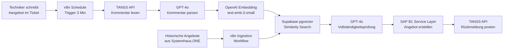

# TANSS → Systemhaus.ONE Angebots-Automatisierung mit RAG

Automatische Angebotserstellung aus TANSS-Tickets mit KI-gestützter Vollständigkeitsprüfung.

Ein Techniker schreibt `#angebot` in einen TANSS-Ticket-Kommentar – der Rest passiert automatisch:
n8n erkennt den Kommentar, parst die gewünschten Positionen mit GPT-4o, prüft die Vollständigkeit
gegen historische Angebote (RAG via Supabase pgvector), erstellt das Angebot in Systemhaus.ONE
und gibt Rückmeldung im Ticket.

## Architektur

```
TANSS Kommentar (#angebot)
        │
        ▼ Polling alle 3 Min
┌───────────────────┐
│   n8n Workflow    │
│                   │
│  1. TANSS API     │──── Kommentar lesen
│  2. GPT-4o Parse  │──── Freitext → Positionen (JSON)
│  3. Embedding     │──── text-embedding-3-small (1536 Dim)
│  4. Supabase RAG  │──── Top-5 ähnliche Angebote (pgvector)
│  5. GPT-4o Check  │──── Fehlende Positionen identifizieren
│  6. S1 API        │──── Angebot erstellen (SAP B1 Service Layer)
│  7. TANSS API     │──── Rückmeldungs-Kommentar posten
└───────────────────┘
        │                       ▲
        └───── Angebot #1042 ───┘
```

**Mermaid-Diagramm:**



## Voraussetzungen

| Komponente | Version | Anmerkung |
|-----------|---------|-----------|
| n8n (self-hosted) | >= 1.40.0 | Mit AI/LangChain-Paket |
| Supabase | Cloud oder self-hosted | pgvector Extension erforderlich |
| OpenAI API | - | Zugriff auf gpt-4o + text-embedding-3-small |
| TANSS | - | API-Zugang und dedizierter API-User |
| Systemhaus.ONE | SAP B1 Service Layer v10+ | Port 50000 erreichbar |

## Quickstart (5 Schritte)

### Schritt 1: Supabase Migrations ausführen

In der Supabase SQL-Konsole ausführen (in dieser Reihenfolge):

```sql
-- Dateiinhalt kopieren und ausführen:
-- supabase/migrations/001_create_angebote_vectors.sql
-- supabase/migrations/002_create_match_function.sql
-- supabase/migrations/003_create_ingestion_helpers.sql
```

### Schritt 2: Umgebungsvariablen konfigurieren

```bash
cp .env.example .env
# .env mit eigenen Werten befüllen
```

### Schritt 3: Workflows in n8n importieren

1. n8n öffnen → **Workflows** → **Import from File**
2. `n8n-workflows/tanss-s1-angebot-workflow.json` importieren
3. `n8n-workflows/angebote-ingestion-workflow.json` importieren
4. OpenAI Credentials in beiden Workflows eintragen (Node-ID: `REPLACE_ME_OPENAI`)

### Schritt 4: Historische Angebote importieren (RAG-Seed)

```bash
# Beispieldaten importieren (zum Testen)
curl -X POST http://dein-n8n:5678/webhook/angebote-ingestion \
  -H "Content-Type: application/json" \
  -d @examples/beispiel-angebote-historisch.json

# Oder: Aus Systemhaus.ONE importieren
# → Ingestion-Workflow manuell starten, Datenquelle "s1-api" wählen
```

### Schritt 5: Workflow aktivieren und testen

1. Haupt-Workflow aktivieren (Toggle auf "Aktiv")
2. Test-Kommentar in TANSS schreiben:
   ```
   #angebot Kunde braucht 3 Arbeitsplatz-PCs mit Monitor und Office 365
   ```
3. Nach max. 3 Minuten: Rückmeldung erscheint im TANSS-Ticket

---

## Konfiguration

Alle Umgebungsvariablen (`.env.example` als Vorlage):

### TANSS

| Variable | Beispiel | Beschreibung |
|----------|---------|-------------|
| `TANSS_BASE_URL` | `https://firma.tanss.de` | Basis-URL ohne trailing slash |
| `TANSS_USERNAME` | `api-user` | API-User (kein Admin nötig) |
| `TANSS_PASSWORD` | `geheim` | Passwort des API-Users |
| `TANSS_POLL_INTERVAL_MINUTES` | `3` | Polling-Intervall in Minuten |
| `TANSS_TRIGGER_HASHTAG` | `#angebot` | Auslöse-Hashtag (case-insensitive) |

### Systemhaus.ONE

| Variable | Beispiel | Beschreibung |
|----------|---------|-------------|
| `S1_BASE_URL` | `https://server:50000` | Service Layer URL |
| `S1_USERNAME` | `api-user` | SAP B1 Benutzer |
| `S1_PASSWORD` | `geheim` | SAP B1 Passwort |
| `S1_COMPANY_DB` | `S1_PROD` | Datenbank-Name |
| `S1_DEFAULT_TAX_CODE` | `T1` | Standard-Steuerschlüssel |

### Supabase

| Variable | Beispiel | Beschreibung |
|----------|---------|-------------|
| `SUPABASE_URL` | `https://xxx.supabase.co` | Projekt-URL |
| `SUPABASE_ANON_KEY` | `eyJ...` | Anon Key (für Lesezugriff) |
| `SUPABASE_SERVICE_ROLE_KEY` | `eyJ...` | Service Role Key (für Schreibzugriff) |

### OpenAI

| Variable | Beispiel | Beschreibung |
|----------|---------|-------------|
| `OPENAI_API_KEY` | `sk-...` | API Key |
| `OPENAI_MODEL` | `gpt-4o` | LLM für Parsing und RAG |
| `OPENAI_EMBEDDING_MODEL` | `text-embedding-3-small` | Embedding-Modell |

### Benachrichtigungen (optional)

| Variable | Beispiel | Beschreibung |
|----------|---------|-------------|
| `SLACK_WEBHOOK_URL` | `https://hooks.slack.com/...` | Slack Incoming Webhook |
| `NOTIFICATION_EMAIL` | `it@firma.de` | E-Mail für Fehler-Alerts |

---

## Verzeichnisstruktur

```
tanss-s1-angebot-rag/
├── README.md                              # Diese Datei
├── .env.example                           # Umgebungsvariablen-Vorlage
├── supabase/
│   └── migrations/
│       ├── 001_create_angebote_vectors.sql    # Tabelle + Indizes
│       ├── 002_create_match_function.sql      # Similarity Search RPC
│       └── 003_create_ingestion_helpers.sql   # Views und Helper-Funktionen
├── n8n-workflows/
│   ├── tanss-s1-angebot-workflow.json         # Haupt-Workflow
│   └── angebote-ingestion-workflow.json       # Ingestion-Workflow
├── prompts/
│   ├── kommentar-parser.md                # System-Prompt: Freitext → Positionen
│   ├── rag-vollstaendigkeitspruefung.md   # System-Prompt: Fehlende Positionen
│   └── angebot-serialisierung.md          # Vorlage: Text-Serialisierung für Embeddings
├── docs/
│   ├── SETUP.md                           # Installationsanleitung
│   ├── API-REFERENZ.md                    # TANSS + S1 + Supabase API-Endpunkte
│   ├── RAG-STRATEGIE.md                   # Embedding/Chunking-Strategie
│   └── ARCHITEKTUR.md                     # Datenfluss und Designentscheidungen
└── examples/
    ├── beispiel-kommentar.json            # Beispiel TANSS-Kommentar
    ├── beispiel-angebot-s1.json           # Beispiel S1 Quotation Payload
    └── beispiel-angebote-historisch.json  # Seed-Daten für Supabase RAG
```

---

## FAQ / Troubleshooting

### "Kommentar wird nicht erkannt"

- Prüfe ob `#angebot` (mit Hashtag, kein Leerzeichen davor) im Kommentar steht
- Prüfe `TANSS_TRIGGER_HASHTAG` in der Konfiguration
- Prüfe im n8n Execution Log: Node "Neue Angebot-Kommentare filtern" – was gibt er aus?
- Static Data prüfen: Evtl. ist `letzterCheck` zu weit in der Zukunft gesetzt

### "confidence_score zu niedrig, Workflow stoppt"

- Der Kommentar ist zu vage für das LLM
- Lösung: Kommentar konkretisieren (Produktnamen, Mengen angeben)
- Schwelle senken: Im Workflow Node "Confidence ausreichend?" den Wert von 0.6 auf 0.5 ändern

### "Keine historischen Angebote gefunden (RAG gibt 0 Treffer)"

- Zu wenige Angebote in Supabase (< 5)
- Similarity-Threshold zu hoch: Im Node "Supabase: RAG Similarity Search" `match_threshold` auf 0.55 senken
- Angebot-Typ passt nicht: Prüfe ob `filter_typ` korrekt gesetzt wird

### "S1-Angebot hat keine Artikelnummern (ItemCode fehlt)"

- Normal! Freitext-Angebote ohne ItemCode werden von SAP B1 unterstützt
- Voraussetzung: In SAP B1 muss ein „Freitext-Artikel" konfiguriert sein
- Alternativ: Im Workflow den `ItemCode`-Lookup gegen `/b1s/v2/Items` ergänzen

### "S1 Login schlägt fehl (HTTP 401)"

- Credentials prüfen (`S1_USERNAME`, `S1_PASSWORD`, `S1_COMPANY_DB`)
- S1 Service Layer nur über HTTPS erreichbar (self-signed Cert: `ssl_verify: false` im HTTP Node)
- Firewall: Port 50000 von n8n-Server aus erreichbar?

### "TANSS: apiKey nach einigen Stunden ungültig"

- Jeder Workflow-Run macht einen frischen Login – kein Token-Caching
- Wenn der Run länger als die JWT-Laufzeit dauert (sehr selten): Fehler-Handler fängt 401 ab

### "Kommentare werden doppelt verarbeitet"

- n8n Static Data funktioniert nur im **Production-Modus** persistent
- Im Test-Modus (manuelle Ausführung) wird Static Data nicht gespeichert
- Lösung: Workflow aktivieren und auf automatischen Schedule-Trigger warten

---

## Weiterentwicklung

### Kurzfristig (Quick Wins)

- [ ] S1 Kunden-Lookup: `customerId` aus TANSS → `CardCode` in S1 automatisch auflösen
- [ ] Artikelnummern-Lookup: Fuzzy-Match gegen S1 Items API
- [ ] E-Mail-Benachrichtigung als Alternative zu Slack

### Mittelfristig

- [ ] Monatlicher Cronjob für automatische Re-Ingestion neuer S1-Angebote
- [ ] Branchen-Filter im RAG: Kanzlei-Angebote nur gegen Kanzlei-Angebote prüfen
- [ ] Dashboard: Supabase Studio View für Angebots-Statistiken

### Langfristig

- [ ] Embedding-Modell wechseln auf `deepset-ai/mxbai-embed-de-large-v1` (besser für Deutsch)
- [ ] Preisvorschläge: LLM schlägt Preise basierend auf historischen Angeboten vor
- [ ] TANSS-Approval: Techniker kann per Kommentar Angebot freigeben oder ablehnen

---

## Lizenz

MIT License – frei verwendbar, anpassbar und weitergegeben.

```
Copyright (c) 2026

Permission is hereby granted, free of charge, to any person obtaining a copy
of this software and associated documentation files (the "Software"), to deal
in the Software without restriction, including without limitation the rights
to use, copy, modify, merge, publish, distribute, sublicense, and/or sell
copies of the Software, and to permit persons to whom the Software is
furnished to do so, subject to the following conditions:

The above copyright notice and this permission notice shall be included in all
copies or substantial portions of the Software.

THE SOFTWARE IS PROVIDED "AS IS", WITHOUT WARRANTY OF ANY KIND, EXPRESS OR
IMPLIED, INCLUDING BUT NOT LIMITED TO THE WARRANTIES OF MERCHANTABILITY,
FITNESS FOR A PARTICULAR PURPOSE AND NONINFRINGEMENT.
```
